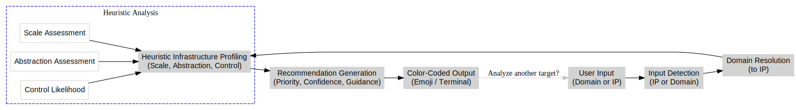

# ContextLens v1


**ContextLens** is a decision-support tool for security practitioners, developers, and auditors. It analyzes a domain or IP and provides **contextual recommendations** on whether to focus on **application-layer assessments** or **infrastructure-level evaluation**.

This helps teams **prioritize effort**, save time, and reduce unnecessary noise during security assessments.

---

## Features

* **Unified Input**: Accepts a domain or IP address.
* **Automatic IP Resolution**: Resolves domains to IPs automatically.
* **Infrastructure Profiling**: Classifies targets by scale, abstraction, and control likelihood.
* **Effort Recommendation**: Suggests whether to prioritize application-layer or infrastructure-level assessments.
* **Color-Coded Output**: Emoji-based indicators for quick readability on GitHub.

---

## Architecture Overview

<p align="center">
  
</p>

---

## Architecture Explanation

### 1. Input Detection

* Determines if the input is a **domain** or **IP address**.
* Validates format and readiness for analysis.

### 2. Domain Resolution

* Converts domains to their corresponding IP addresses.
* Ensures a unified representation for further analysis.

### 3. Heuristic Infrastructure Profiling

* Checks for hyperscaler/CDN patterns (AWS, Azure, Google, Cloudflare, Akamai, Fastly, etc.).
* Classifies infrastructure across three dimensions:

  * **Scale** (small ↔ large)
  * **Abstraction** (low ↔ high)
  * **Control Likelihood** (low ↔ high)

### 4. Recommendation Generation

* Suggests **priority**: application-layer vs infrastructure-level.
* Provides **confidence** and **guidance**.
* Explains rationale based on detected heuristics.

### 5. Color-Coded Output

* Uses **green/yellow/red indicators** for readability.
* Supports rapid comprehension of security posture.
* Includes advisory disclaimers.

---

## Why ContextLens Exists

* Modern infrastructure often hides behind **managed clouds** and CDNs.
* Blind infrastructure-level testing can waste time on abstracted or shared environments.
* ContextLens **prioritizes security effort**, reducing wasted work and focusing on areas with the most meaningful impact.

---

## Installation

```bash
git clone https://github.com/404saint/contextlens.git
cd contextlens
pip3 install colorama
```

> Tested with **Python 3.10+**.

---

## Usage

```bash
python3 contextlens.py
```

**Workflow:**

1. Enter a **domain or IP**.
2. Receive a **contextual infrastructure profile**.
3. Get **effort recommendation**, confidence, and rationale.

## Example Usage

#### Domain Example: `google.com`

```markdown
Target              : google.com  
Resolved IP         : 216.58.223.78  

Infrastructure Profile
 - Scale             : large
 - Abstraction       : high
 - Control Likelihood: low

Recommendation
 → Priority          : application-layer
 → Confidence        : high
 → Rationale:
    - Large-scale managed infrastructure detected
    - Infrastructure is abstracted behind shared control planes
 → Guidance          : Focus on application logic, configuration, and integration boundaries
```

#### IP Example: `197.243.26.224`

```markdown
Target              : 197.243.26.224  
Resolved IP         : 197.243.26.224  

Infrastructure Profile
 - Scale             : small
 - Abstraction       : low
 - Control Likelihood: higher

Recommendation
 → Priority          : infrastructure-relevant
 → Confidence        : medium
 → Rationale:
    - No evidence of hyperscaler or CDN abstraction
    - Infrastructure characteristics suggest direct exposure
 → Guidance          : Infrastructure-level assessment may be a rational use of effort
```
---

## Technologies

* **Python 3**
* **colorama** for terminal colors
* **socket** for DNS/IP resolution
* Heuristic scoring for infrastructure abstraction

---

## Future Plans

* IPv6 support
* Multi-A record and load-balanced domain handling
* Integration with public ASN databases for precise scoring
* Optional JSON output for automation pipelines

---

## Ethical Use & Disclaimer

* **No attacks performed**.
* **Advisory output only**.
* Use responsibly and legally. Respect external system boundaries.

---

## License

MIT License — see [LICENSE](LICENSE) for details.
